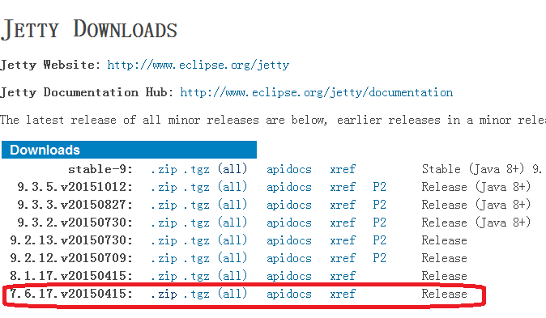
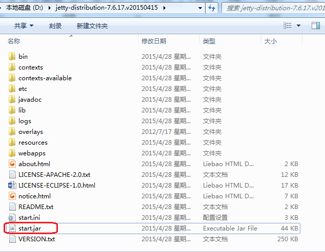

去官网下载 http://download.eclipse.org/jetty/
 


然后解压到指定目录下，运行start.jar 启动

 

这种方式无法快捷关闭，需要 在命令行中打指令

```
netstat -ano | findStr "8080"
```

  ，其中"8080"是web服务器开启的端口。最后一列为pid
然后输入  

```
taskkill  -F  /pid  6220
```

即可杀死该进程


要修改端口可以去etc目录下的jetty.xml文件中修改

```
<Set name="port"><Property name="jetty.port" default="8088"/></Set>

```
